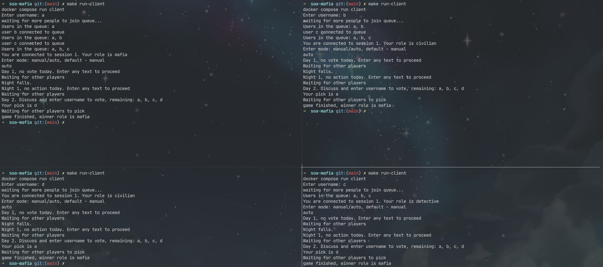
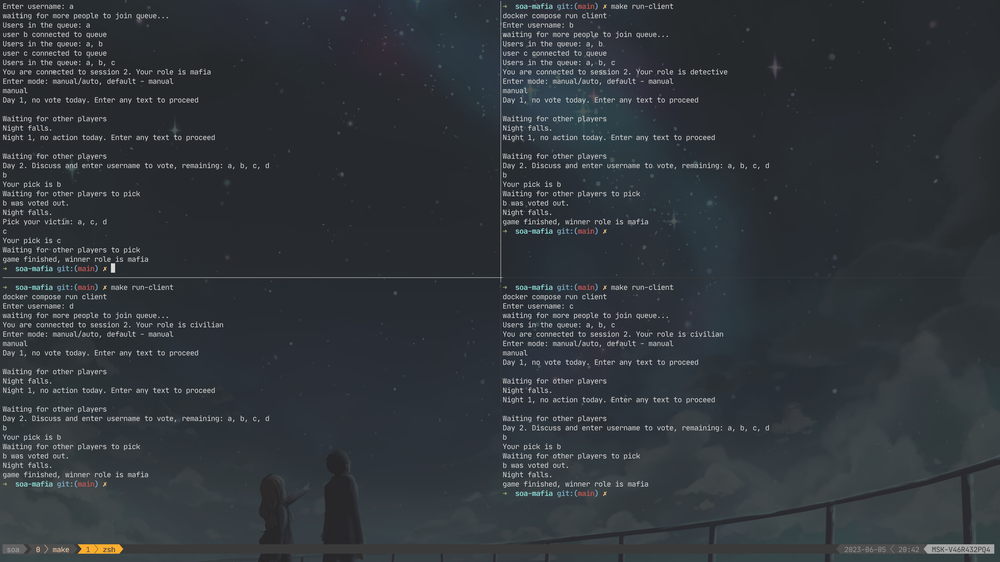

# soa-mafia

Для запуска сервера необходимо ввести команду:

```bash
make run-server
```

Далее можно запусить несколько клиентов (размер сессии игры по умолчанию - 4) с помощью команды:

```bash
make run-client
```

В начале необходимо ввести имя пользователя и режим игры - `manual` или `auto`. В режиме `auto` все действия совершаются автоматически, при необходимости выбирается случайное действие.

В ручном режиме нужно вводить команды руками.

Пример игры в автоматическом режиме:



Пример игры в ручном режиме:

